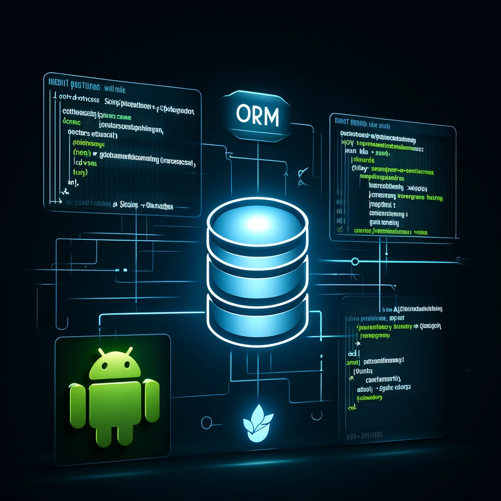

# **BestPractices-WebApp-Part1-ORM-SpringDataJpa**

## **Introduction**  
This repository is the first part of a series on best practices for building a web application. It focuses on Object-Relational Mapping (ORM) using Spring Data JPA with the goal of creating a scalable, maintainable, and well-structured backend.

## **Objectives**  
✔️ Understand **ORM** and its advantages.  
✔️ Implement **CRUD operations** using **Spring Data JPA**.  

## **Technologies Used**  
🔹 **Java 17+**   
🔹 **Spring Boot**  
🔹 **Hibernate**  
🔹 **H2 Database**  

## **Conclusion**  
This project demonstrates the use of **Spring Data JPA** to interact with a database, highlighting the advantages of **ORM** in modern applications.  

